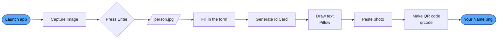

<div align="center">


<br />


<br /><br />

[Features](#-features) •
[How it works](#-how-it-works) •
[Quick start](#-quick-start) •
[Usage](#-usage) •
[Build an .exe](#-build-a-standalone-exe) •
[Roadmap](#-roadmap)

</div>

---

## 🪪 What is this?

**ID Card Generator** is a small desktop app that turns a webcam snapshot and five form fields into a ready-to-print ID card. It draws the card, stamps a random 7-digit ID number in red, drops in the photo, and adds a QR code, all saved as a single PNG.

No design software and no templates to fiddle with. Open the app, look at the camera, type, click.

<div align="center">

```text
┌────────────────────────────────────────────────────────┐
│                                                        │
│   ACME CORPORATION                 ┌──────────────┐    │
│                                    │              │    │
│                                    │    PHOTO     │    │
│   Jane Doe                         │              │    │
│                                    └──────────────┘    │
│   ID 4829173                       ┌──────────────┐    │
│                                    │ ▛▀▜ ▚▞▚ ▛▀▜  │    │
│   Female                           │ ▙▄▟ ▞▚▞ ▙▄▟  │    │
│                                    │ ▚▞▚ ▞▚▞ ▚▞▚  │    │
│   +91 98765 43210                  │ ▛▀▜ ▚▞▚ ▞▚▞  │    │
│                                    │ ▙▄▟ ▞▚▞ ▚▞▚  │    │
│   12 MG Road, Bengaluru            └──────────────┘    │
│                                                        │
└────────────────────────────────────────────────────────┘
              the card layout, 1000 × 900 px
```

</div>

<!--
  Add a real demo here once you have one. A short screen recording works best:
  <div align="center"></div>
-->

---

## ✨ Features

<table>
  <tr>
    <td width="50%" valign="top">
      <h3>📸 Live webcam capture</h3>
      A mirrored preview opens with OpenCV. Press <kbd>Enter</kbd> to take the shot. The frame is cropped to the centre automatically.
    </td>
    <td width="50%" valign="top">
      <h3>🎨 Card drawn from scratch</h3>
      Pillow renders a 1000 × 900 card: company name as the header, then name, gender, phone and address.
    </td>
  </tr>
  <tr>
    <td width="50%" valign="top">
      <h3>🔢 Automatic ID number</h3>
      Every card gets a random 7-digit ID, printed in red so it stands out.
    </td>
    <td width="50%" valign="top">
      <h3>🔳 Built-in QR code</h3>
      The company name and ID number are encoded into a QR code and placed under the photo.
    </td>
  </tr>
  <tr>
    <td width="50%" valign="top">
      <h3>🖥️ Simple desktop form</h3>
      A single PyQt5 window with five fields and two buttons. Nothing to learn.
    </td>
    <td width="50%" valign="top">
      <h3>📦 Ships as an .exe</h3>
      A cx_Freeze script is included, so the app can run on machines without Python.
    </td>
  </tr>
</table>

---

## ⚙️ How it works



<details>
<summary><b>What goes where on the card</b></summary>

<br />

| Element | Source field | Position (x, y) | Style |
| :-- | :-- | :-- | :-- |
| Company name | Your Company Name | 50, 50 | Arial 80, black |
| Full name | Your Full Name | 50, 250 | Arial 45, black |
| ID number | generated | 50, 350 | Arial 60, red |
| Gender | Your Gender | 50, 550 | Arial 45, black |
| Phone | Your Active Phone Number | 50, 650 | Arial 45, black |
| Address | Your Current Adress | 50, 750 | Arial 45, black |
| Photo | webcam | 600, 75 | cropped frame |
| QR code | company + ID | 600, 400 | default size |

</details>

---

## 🧰 Tech stack

<div align="center">


</div>

| Layer | Library | Used for |
| :-- | :-- | :-- |
| Interface | **PyQt5** | The form window, buttons and input fields |
| Camera | **opencv-python** | Live preview, mirroring, cropping, saving the photo |
| Rendering | **Pillow** | Drawing text and compositing the photo and QR code |
| QR code | **qrcode** | Encoding the company name and ID number |
| Packaging | **cx_Freeze** | Building a standalone Windows executable |

---

## 🚀 Quick start

**1. Clone the repository**

```bash
git clone https://github.com/your-username/id-card-generator.git
cd id-card-generator
```

**2. Install the dependencies**

```bash
pip install PyQt5 Pillow opencv-python qrcode
```

**3. Run it**

```bash
python id_gen.py
```

> [!NOTE]
> The card text uses `arial.ttf`, which ships with Windows. On macOS or Linux, place a copy of the font next to `id_gen.py` or change the font path in the code.

---

## 🕹️ Usage

| Step | Action | What happens |
| :-: | :-- | :-- |
| 1 | Click **Capture Image** | A live, mirrored webcam window opens |
| 2 | Press <kbd>Enter</kbd> | The photo is saved as `person.jpg` |
| 3 | Fill in company, name, gender, address and phone | These become the text on the card |
| 4 | Click **Generate Id Card** | The card is saved as `<Your Full Name>.png` |

> [!IMPORTANT]
> Capture a photo **before** generating the card. The generator expects `person.jpg` to exist.

**Files written to the working folder**

```text
person.jpg          webcam photo
<Full Name>.png     the finished ID card  ← this is the one you want
card.jpg            intermediate (card + photo)
<ID number>.bmp     the QR code on its own
```

---

## 📦 Build a standalone .exe

```bash
pip install cx_Freeze
python setup.py build
```

The executable is created in the `build/` folder. Copy the whole folder to another Windows machine and run it there. No Python installation is needed.

---

## 🗂️ Project structure

```text
id-card-generator/
├── id_gen.py      Main app: the form, webcam capture and card generation
├── index.py       Alternate launcher that loads the Qt Designer file id_gen.ui
├── id_gen.ui      Qt Designer layout used by index.py
├── setup.py       cx_Freeze build script
└── README.md
```

---

## 🧭 Roadmap

- [x] Webcam capture with a live preview
- [x] Card rendering with photo and QR code
- [x] Standalone Windows build
- [ ] Friendly error messages when no camera or photo is found
- [ ] Close the window cleanly after a card is generated
- [ ] Bundle a font so the app runs on macOS and Linux
- [ ] Save every issued card to a MySQL database
- [ ] Put the full card details in the QR code
- [ ] Card themes, a company logo slot and PDF export

---

## 🤝 Contributing

Ideas, bug reports and pull requests are welcome.

1. Fork the repository
2. Create a branch: `git checkout -b feature/my-idea`
3. Commit your changes: `git commit -m "Add my idea"`
4. Push the branch and open a pull request

---

<div align="center">

**If this project saved you a trip to the print shop, give it a ⭐**


</div>
